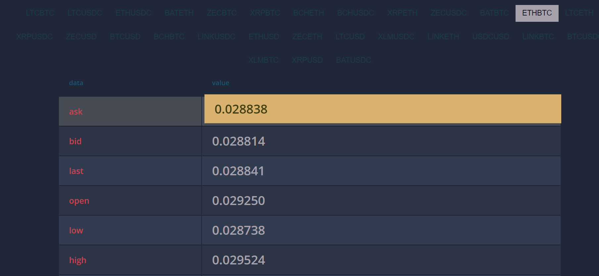

# CRYPTO EXCHANGE RATE IN REALTIME 
A web app to showcase exchange rate of all crypto-currencies in realtime

[](https://github.com/atiqg/accessgate-labs-ticker)

## [Web App](https://accessgate-test.netlify.app/)       

</br>

## Assignment:           
[✔️] Ticker API: wscat -c wss://api.crosstower.com/api/2/ws       
[✔️] Above is a web socket api that returns real-time market data for Crypto coins.     
[✔️] Fetch all kinds of exchange types          
[✔️] Use personal proxy server to escape cors policy        
[✔️] Realtime data update       
[✔️] Dynamically add all exchange types and their data       
[✔️] Make a small web based widget in tabular format UI that represents the above changing dataset. Be creative in UI         

[✔️] Link to website where we can try out the assignment        
[✔️] Complete source code. You can send us github      
</br>

## Installation
#### Step 1
```
git clone https://github.com/atiqg/accessgate-labs-ticker.git
cd accessgate-labs-ticker
npm install
```

#### Step 2
* Make a netlify website named as "https://accessgate-test.netlify.app/"
* Or change url in functions folder and script.js file
* upload repository to netlify
* ENJOY!!!